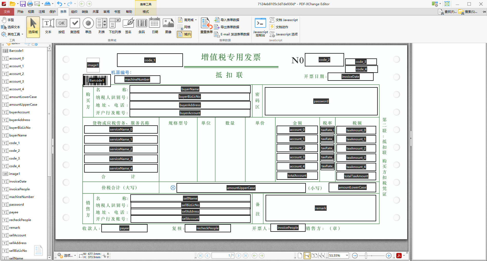

# easy2printPDF
使用模板的方式 写属于你的pdf

itext7 中文文档 https://github.com/iTextCN/itext7-in-mandarin

TODO LIST

| 功能         | 完成度       |
| ------------ | ------------ |
| 表单填充     | done         |
| 图片填充     | 本地图片路径已经支持,网络图片需要或者字节流图片暂时无法支持      |
| 列表动态填充 | will rebuild |


1、
对pdf整理表单格式,如下图



2、依赖 itext 框架 封装了一层 模板层，可以很方便的填充pdf
```xml
<dependency>
  <groupId>com.github.zhuobinchan</groupId>
  <artifactId>easy2print-pdf-core</artifactId>
  <version>1.1</version>
</dependency>
```

3、测试类，相关东西放在项目的test，resource文件下
```java
public class PdfTest {
    @Test
        public void test2() {
            InvoiceCodePdfModel model = new InvoiceCodePdfModel();
            model.setCode_1("123");
            model.setMachineNumber("abc哈哈");
    
            ArrayList<InvoiceCodeServiceParam> objects = new ArrayList();
            InvoiceCodeServiceParam invoiceCodeServiceParam = new InvoiceCodeServiceParam();
            invoiceCodeServiceParam.setServiceName("setServiceName1");
            objects.add(invoiceCodeServiceParam);
            model.setParams(objects);
    
    //        model.setImage1("https://raw.githubusercontent.com/alibaba/easyexcel/master/src/test/resources/converter/img.jpg");
            model.setImage1("D:\\idea_project\\easy2printPDF\\easy2printPDF\\easy2print-pdf-core\\src\\test\\resources\\model\\image.gif");
    
            System.out.println(PdfModelUtils.printPdf("D:\\idea_project\\easy2printPDF\\easy2printPDF\\easy2print-pdf-core\\src\\test\\resources\\model\\7124eb8105c3d7de930d.pdf", "D:\\idea_project\\easy2printPDF\\easy2printPDF\\easy2print-pdf-core\\src\\test\\resources\\pdf\\", model, InvoiceCodePdfModel.class));
        }
    
    
        public static class InvoiceCodePdfModel {
            @PdfField(fieldName = "code_1")
            @PdfFieldStyle
            private String code_1; // 发票左上角代码
    
            @PdfField(fieldName = "machineNumber")
            @PdfFieldStyle
            private String machineNumber; // 机器编号
    
            @PdfField(fieldName = "params", ignoreFieldNamePrefix4Collection = true)
            private List<InvoiceCodeServiceParam> params;
    
            //图片填充
            @PdfField(fieldName = "image1", converter = ImagePathConverter.class)
            private String image1;
            //get set...
        }
    
        public static class InvoiceCodeServiceParam {
            @PdfField(fieldName = "serviceName_${COLLECTION_INDEX}")
            private String serviceName;
            //get set...
        }
}
```

